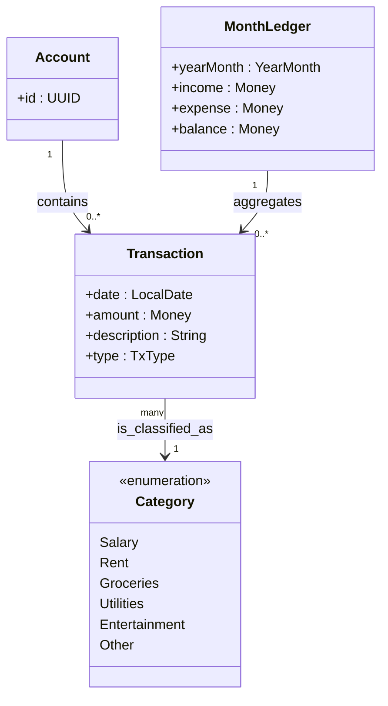

# money-minder – Relazione di Analisi
> Progetto d’esame — PSS 23/24  
> Studente: <Nome Cognome> · <nome.cognome>@studio.unibo.it

## Abstract
Questo documento descrive **cosa** dovrà fare *money-minder* (gestore di finanze personali) e **quale dominio** si intende modellare, senza ancora entrare in decisioni di design o dettagli implementativi.  
Lo scopo è offrire al docente una visione chiara e completa dei requisiti funzionali/non funzionali e del modello concettuale prima di iniziare la progettazione.

---

## Indice
1. [Analisi](#analisi)  
   1.1 [Requisiti](#requisiti)  
   1.2 [Analisi e modello del dominio](#analisi-e-modello-del-dominio)  
2. [Design (placeholder)](#design)  
3. [Sviluppo (placeholder)](#sviluppo)  
4. [Testing (placeholder)](#testing)  
5. [Note di sviluppo & autovalutazione (placeholder)](#note-di-sviluppo)  
6. [Commenti finali (placeholder)](#commenti-finali)  

---

## Analisi
### Requisiti

#### Requisiti funzionali
| ID  | Descrizione                                                                                                                                 |
|-----|----------------------------------------------------------------------------------------------------------------------------------------------|
| RF1 | L’utente può **registrare una transazione** indicando data, descrizione, importo, tipo (entrata/uscita) e categoria.                         |
| RF2 | L’utente può **visualizzare l’elenco** completo delle transazioni in ordine cronologico.                                                     |
| RF3 | L’utente può **modificare o eliminare** una transazione esistente.                                                                           |
| RF4 | L’applicazione genera un **report mensile**: totale entrate, uscite, saldo iniziale/finale e ripartizione per categoria.                     |
| RF5 | I dati devono essere **persistenti**: chiudendo e riaprendo l’app, il registro rimane invariato.                                             |
| RF6 | Tutte le funzionalità devono essere disponibili **via riga di comando**; eventuale GUI verrà trattata come estensione successiva.            |

#### Requisiti non funzionali
| ID  | Descrizione                                                                                                             |
|-----|--------------------------------------------------------------------------------------------------------------------------|
| RNF1| Compatibile con **Java 17** su Windows, Linux, macOS (fat JAR eseguibile).                                               |
| RNF2| **Precisione monetaria**: usare rappresentazioni esatte (es. 2 decimali, arrotondamenti controllati).                    |
| RNF3| Tempo di avvio ≤ 2 s su hardware consumer; operazioni comuni (< 100 transazioni) ≤ 100 ms.                              |
| RNF4| Dati archiviati in un **file utente leggibile** (JSON) per semplicità di backup e ispezione.                             |
| RNF5| Codice versionato con **Git + GitHub**, build via **Gradle**, test automatici con **JUnit 5**.                           |
| RNF6| Il software dev’essere **estendibile**: cambio formato di persistenza o aggiunta CSV/grafici senza impatti strutturali. |

---

### Analisi e modello del dominio
L’applicazione affronta il problema della **gestione di movimenti finanziari personali**.  
Si distinguono i seguenti concetti di dominio:

| Concetto          | Descrizione sintetica                                                       |
|-------------------|------------------------------------------------------------------------------|
| **Account**       | Rappresenta il “libro mastro” personale. Contiene un insieme di transazioni. |
| **Transaction**   | Singolo movimento di denaro, caratterizzato da data, importo, descrizione, tipo. |
| **Category**      | Etichetta che classifica le transazioni (es. *Salary*, *Rent*, *Groceries*). |
| **MonthLedger**   | Vista aggregata delle transazioni in un dato `Year-Month` (report).          |

> **Sfide principali (dominio)**  
> • Gestire importi in **BigDecimal** evitando errori di arrotondamento.  
> • Supportare **estensioni future** (budget, multivaluta) senza rompere il modello esistente.  

#### UML del dominio
Lo schema mostra **solo entità** e relazioni logiche, senza metodi o dettagli implementativi.

Money è un Value Object che incapsula BigDecimal + currency; la valutazione del cambio è fuori scope per la prima release.

TxType è un’enum {INCOME, EXPENSE} usata solo per distinguere i flussi.
