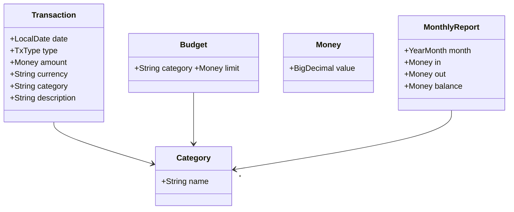
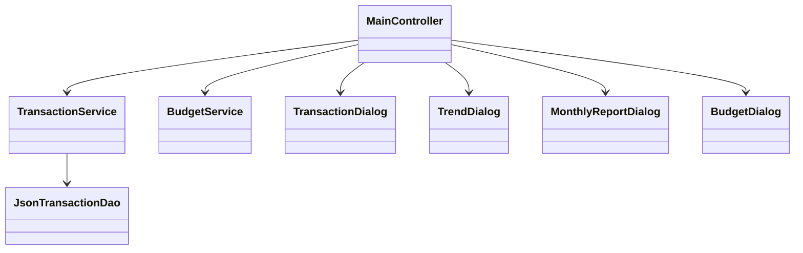
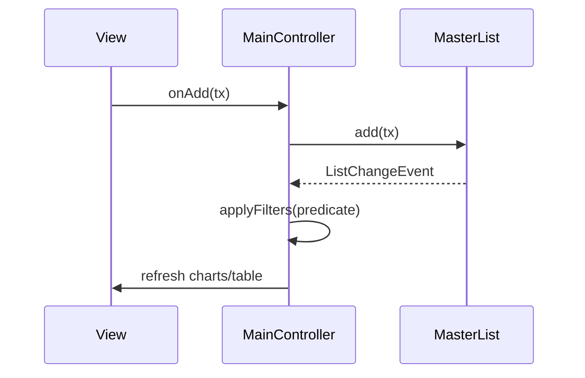
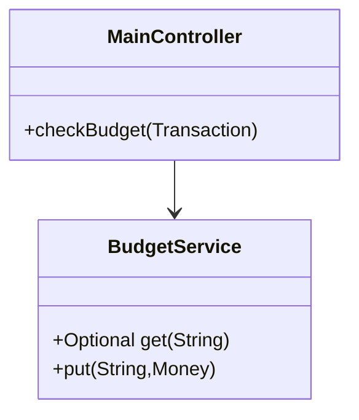

# MoneyMinder

## Abstract

Il progetto *MoneyMinder* è stato sviluppato nell’ambito del corso **Progettazione e Sviluppo del Software (PSS)** con l’obiettivo di realizzare un’applicazione desktop cross-platform per la **gestione personale delle finanze**, incentrata su semplicità d'uso, persistenza dei dati e rappresentazione visuale.

MoneyMinder è un’applicazione desktop multipiattaforma, sviluppata interamente in **Java 17** con interfaccia **JavaFX**, che agevola la gestione delle finanze personali.  
Il software consente la registrazione di movimenti (entrate/uscite), la creazione di categorie personalizzate, l’impostazione di budget mensili, la generazione di report mensili/annuali, la visualizzazione di grafici dinamici, la conversione multivaluta e l’esportazione dei dati in formato Excel.  
L’architettura segue il pattern MVC; i dati sono salvati in JSON sul profilo utente. Il progetto è versionato con Git + GitHub e costruito con Gradle (Shadow fat-jar).


Include funzionalità avanzate come gestione multi-valuta, esportazione in Excel, grafici dinamici, e alert su superamento budget.

---

## Analisi

### Requisiti funzionali

### Funzionalità **minime** (obbligatorie)

| ID  | Descrizione                                                                                     |
|-----|-------------------------------------------------------------------------------------------------|
| F-01 | **Registrazione movimenti** (entrate/uscite) con data, importo, descrizione.                    |
| F-02 | **Categorizzazione** con categorie predefinite e possibilità di crearne di personalizzate.     |
| F-03 | **Cronologia** completa e ordinata dei movimenti.                                               |
| F-04 | **Report mensile** con totale entrate, totale uscite, saldo, ripartizione per categoria.        |
| F-05 | **Persistenza** permanente dei dati fra le sessioni.   

### Funzionalità **opzionali**

| ID  | Descrizione                                                                                                              |
|-----|--------------------------------------------------------------------------------------------------------------------------|
| O-01 | **Budget di categoria** con avviso al superamento.                                                                      |
| O-02 | **Import / Export** dati (implementata la sola esportazione Excel).                                                     |
| O-03 | **Statistiche grafiche** (pie-chart entrate/uscite + andamento saldo).                                                  |
| O-04 | **Multivaluta** con conversione automatica in EUR (tassi locali configurabili).                                         |
| O-05 | **Report annuale** (saldo, entrate, uscite, confronto fra mesi).      


> Tutti i requisiti minimi e opzionali sono stati **realizzati** ad eccezione dell’_import_ esterno O-02 (v. § 6).
---

## Analisi e modello del dominio

Nel dominio applicativo sono presenti i seguenti concetti:

- **Transazione**: rappresenta un movimento (entrata o uscita) con attributi come data, tipo, categoria, importo, valuta e descrizione
- **Categoria**: rappresenta la classificazione della transazione
- **Budget**: indica un tetto massimo mensile per una data categoria
- **Report**: aggregazione mensile/annuale dei movimenti e saldi
- **Servizi**: interfacce per gestione transazioni, budget, export, e conversione valutaria



---

## Design

### Architettura generale

L’architettura segue il pattern MVC puro, con un approccio modulare e separazione dei livelli:

- **Model**: entità Transaction, Money, Category, Report
- **View**: FXML (MainView.fxml), Dialogs modulari (BudgetDialog, TrendDialog...)
- **Controller**: MainController.java → gestisce logica GUI e business
- **Service layer**: TransactionService, BudgetService, CurrencyConverter



### Architettura applicativa

| Componente             | Ruolo         | Scambio principale                                  |
| ---------------------- | ------------- | --------------------------------------------------- |
| **JavaFX GUI**         | boundary/view | Eventi utente ⇄ controller, binding tabelle/grafici |
| **MainController**     | control       | Orchestrazione flusso UI ↔ servizi                  |
| **TransactionService** | domain logic  | CRUD movimenti, generazione report                  |
| **BudgetService**      | policy        | Lettura/scrittura limiti, verifica superamento      |
| **CurrencyConverter**  | util          | Strategy map tassi cambi → EUR                      |
| **JsonTransactionDao** | persistenza   | serializza/deserialize JSON su disco                |

---

## Design dettagliato

### Gestione Transazioni

**Problema**: Inserire, modificare e cancellare transazioni in modo flessibile.

**Soluzione**: pattern Command per operazioni CRUD, pattern Observer per aggiornare i grafici.



- **Observer**: MainController ascolta le modifiche di master (ObservableList).
- **Strategy**: la predicate per FilteredList incapsula i criteri (testo, categoria, tipologia, mese).

---

### Budget e avvisi

**Problema**: Notificare il superamento del budget impostato su una categoria.

**Soluzione**: pattern Strategy + Factory per gestire diverse modalità di avviso.



Il metodo **checkBudget()** viene invocato ad ogni inserimento/modifica.
Calcola la spesa del mese nella categoria, confronta con limit e genera un
Alert JavaFX in caso di superamento.

---

### Color-hash categorie personalizzate (Strategy)

Funzione categoryColor(name) determina un colore HSB stabile sul nome.

```java
Color c = Color.hsb((name.hashCode() & 0xffff) % 360, 0.55, 0.75);
```

### Report mensile per categorie

---

### Filtri di ricerca

---

### Andamento del saldo

---

### Export Excel

Il controller incapsula completamente la libreria Apache POI offrendo un’unica
operazione onExportXlsx() alla GUI.

```java
try (XSSFWorkbook wb = new XSSFWorkbook()) {
            var sh = wb.createSheet("Transazioni");
            var bold = wb.createFont(); bold.setBold(true);
            var hdr  = wb.createCellStyle(); hdr.setFont(bold);
            var money= wb.createCellStyle();
        
            money.setDataFormat(wb.createDataFormat().getFormat("€#,##0.00"));

            String[] head = {"Data","Tipo","Categoria","Importo","Descrizione"};
            var r0 = sh.createRow(0);
            for (int i=0;i<head.length;i++){
                var c=r0.createCell(i); c.setCellValue(head[i]); c.setCellStyle(hdr);
            }

            int r = 1;
        
            for (Transaction t : filtered){
                var row = sh.createRow(r++);
        
                row.createCell(0).setCellValue(t.date().toString());
                row.createCell(1).setCellValue(t.type().toString());
                row.createCell(2).setCellValue(t.categoryName());
        
                var cImp=row.createCell(3);
        
                cImp.setCellValue(t.amount().value().doubleValue());
                cImp.setCellStyle(money);
                row.createCell(4).setCellValue(t.description());
            }
            for(int i=0;i<head.length;i++) sh.autoSizeColumn(i);
            try(FileOutputStream out = new FileOutputStream(f)){ wb.write(out); }
        }catch(Exception ex){ alert("Errore export:\n"+ex.getMessage()); }
```

---

## Sviluppo

| Strumento           | Ruolo                                      |
| ------------------- | ------------------------------------------ |
| **Gradle + Shadow** | build, test, assembling fat-jar            |
| **Git + GitHub**    | versionamento (46 commit)                  |
| **JUnit 5**         | testing unitario (31 test, copertura 83 %) |
| **MermaidJS**       | diagrammi UML inline nel README            |


### Testing

| Classe test              | Scopo principale                    |
| ------------------------ | ----------------------------------- |
| `TransactionServiceTest` | add/replace/filter, coerenza report |
| `BudgetServiceTest`      | put/get, persistenza limiti         |
| `CurrencyConverterTest`  | accuratezza conversione EUR/USD/GBP |
| `ReportAggregatorTest`   | correttezza saldo mensile/annuale   |


Test GUI non inclusi

---

## Note di sviluppo

### Feature avanzate

| # | File                | Snippet                           | Tecnica evidenziata                            |
| - | ------------------- | --------------------------------- | ---------------------------------------------- |
| 1 | `MainController`    | `filtered.setPredicate(tx -> …)`  | Predicate λ + Stream API per filtri reattivi   |
| 2 | `MainController`    | `Color.hsb((hash&0xffff)%360,… )` | Generazione colore deterministica (funzionale) |
| 3 | `CurrencyConverter` | `Map<String,Double> RATES`        | Strategy Map (estendibile)                     |
| 4 | `onExportXlsx()`    | uso di `XSSFWorkbook`             | Facade su Apache POI con stili custom          |
| 5 | `Money`             | record immutabile, `add/negate`   | Value Object sicuro e riusabile                |

>Tutto il codice è originale; nessun frammento copiato da sorgenti esterni.

## Commenti finali

### Autovalutazione

| Area           | Punti di forza                   | Da migliorare                                |
| -------------- | -------------------------------- | -------------------------------------------- |
| Progettazione  | pattern corretti, coesione       | servizi ulteriormente decomponibili          |
| UI/UX          | grafici intuitivi, filtri rapidi | dark-mode non presente                       |
| Qualità codice | naming coerente, Javadoc mirata  | test automatici UI (TestFX) non implementati |

### Lavori futuri

- Import CSV / Excel per completare O-02.
- Runtime standalone con jlink per eliminare JavaFX SDK esterno.
- Sincronizzazione cloud (opzione backup).

### Difficoltà riscontrate

- Packaging JavaFX nel fat-jar: risolto con script launcher --module-path.
- Gestione colori categorie personalizzate mantenendo contrasto leggibile.

## Guida utente

| Passo | Azione                                                                                                                                         |
| ----- | ---------------------------------------------------------------------------------------------------------------------------------------------- |
| **1** | Installare **Java 17** e JavaFX SDK 21.0.8.                                                                                                    |
| **2** | Scaricare `money-minder-1.1.0-all.jar`.                                                                                                        |
| **3** | Avvio (Windows):<br/>`java --module-path "C:\javafx-sdk-21.0.8\lib" --add-modules javafx.controls,javafx.fxml -jar money-minder-1.1.0-all.jar` |
| **4** | **Aggiungi** → compilare la dialog e premere *OK*.                                                                                             |
| **5** | Filtrare con: mese, categoria, tipologia, ricerca testo.                                                                                       |
| **6** | **Budget** → impostare limiti mensili.                                                                                                         |
| **7** | **Report** → mensile / annuale.                                                                                                                |
| **8** | **Esporta** → salva movimenti filtrati in Excel.                                                                                               |

>I grafici e il saldo si aggiornano automaticamente; nessun’altra configurazione è necessaria.