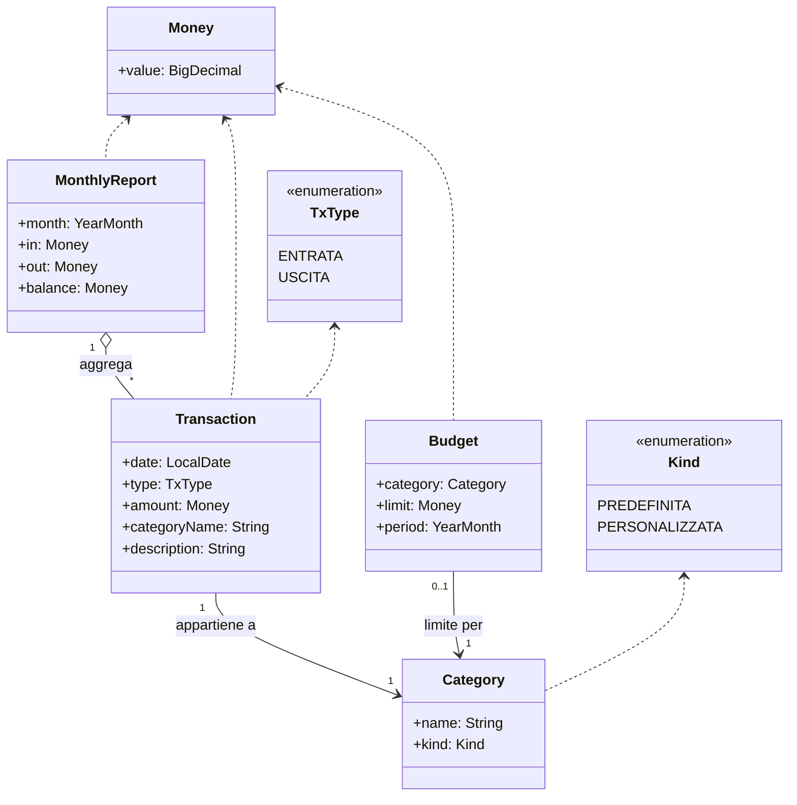
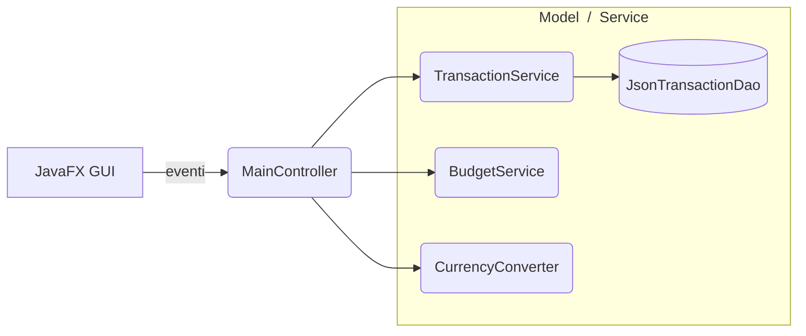
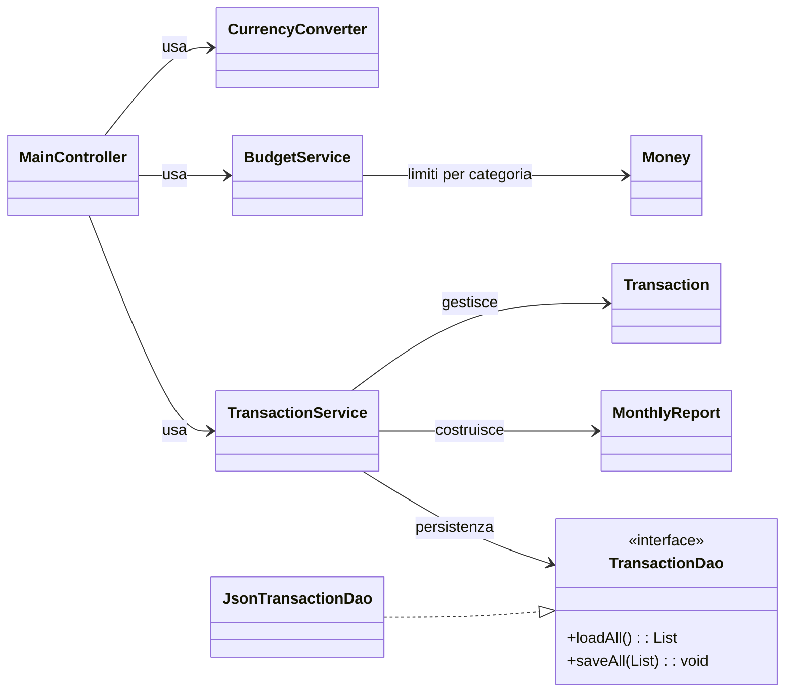
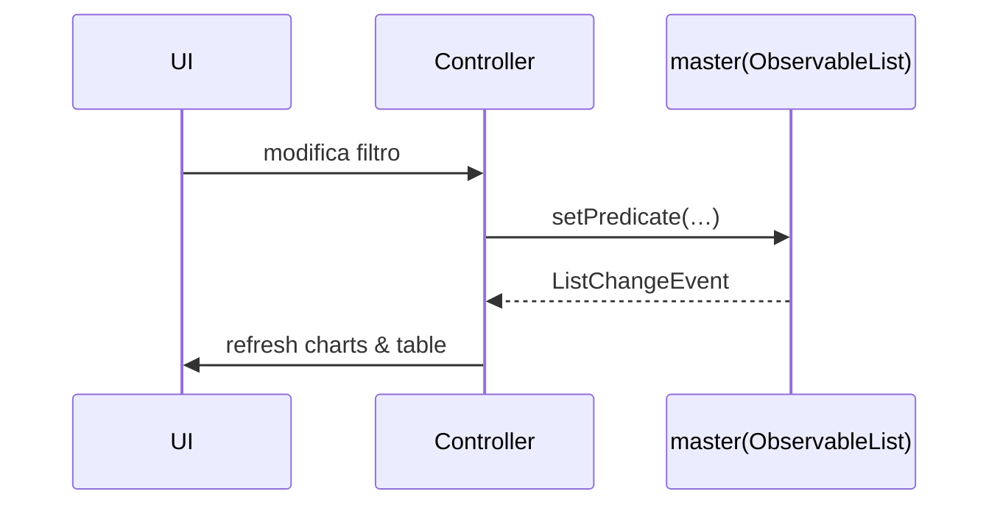
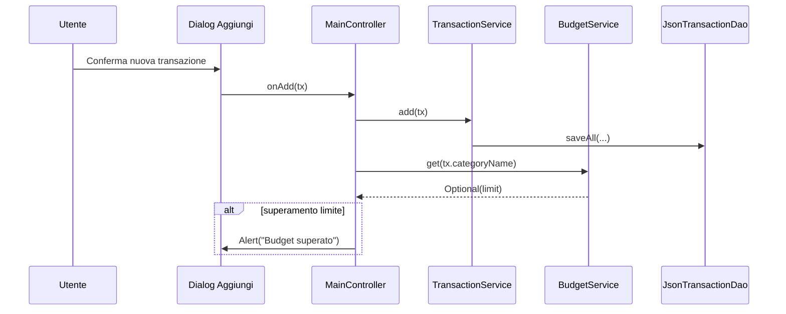
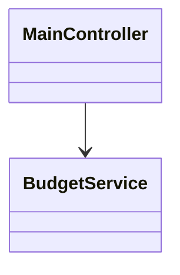
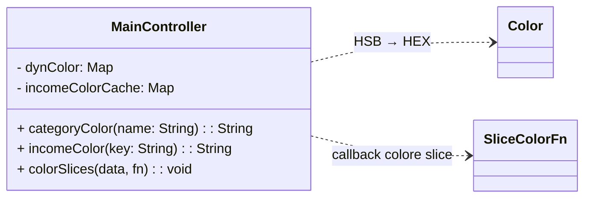
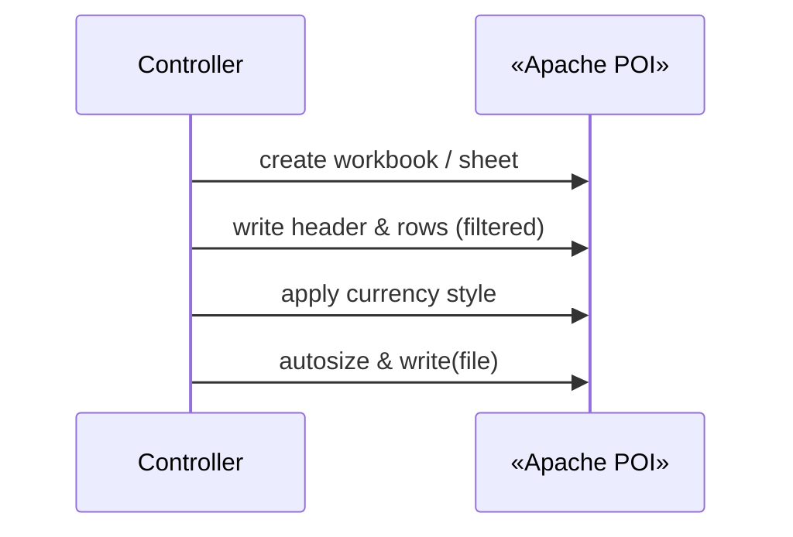

>*Progettazione e Sviluppo del Software – Relazione di progetto*  
>
>**Studente**: Tommaso Bagnolini – Matricola 0001071116 – <tommaso.bagnolini@studio.unibo.it><br>
>**Gruppo**: progetto svolto interamente in forma individuale

# MoneyMinder

## 1. Analisi

MoneyMinder è un’applicazione desktop multipiattaforma concepita per semplificare la gestione delle finanze personali.  
L’utente può registrare movimenti economici, analizzarli tramite report mensili / annuali, impostare dei budget, visualizzare grafici dinamici e convertire importi in più valute.  
L’app salva automaticamente i dati in locale, garantendone la persistenza fra sessioni.

---

### 1.1 Requisiti

#### Funzionalità minime (obbligatorie)

- **Registrazione movimenti** – entrate / uscite con data, importo, descrizione.  
- **Categorizzazione** – associazione a categoria predefinita o creata dall’utente.  
- **Consultazione cronologia** – lista completa, ordinata per data.  
- **Report mensile** – totale entrate, totale uscite, saldo, ripartizione per categoria.  
- **Salvataggio permanente** – i movimenti rimangono fra sessioni.

#### Funzionalità opzionali

- **Budget per categoria** – tetto mensile e alert al superamento.  
- **Import / Export** – esportazione Excel (import pianificato a versioni future).  
- **Statistiche grafiche** – pie-chart entrate / uscite; andamento saldo.  
- **Gestione multivaluta** – conversione automatica verso EUR.  
- **Report annuale** – confronto saldo fra mesi.

> Tutte le funzionalità sopra elencate sono implementate, eccetto l’import di dati esterni.

---

### 1.2 Analisi del dominio

MoneyMinder ruota attorno al concetto di **movimento finanziario**. Ogni movimento possiede:

- data
- importo (espresso nel sistema in EUR, o convertito)
- categoria
- descrizione
- tipologia (entrata / uscita)

>Su tali informazioni si appoggiano budget e riepiloghi periodici (report mensili/annuali)



---

#### Note di lettura

- Ogni **Transaction** ha una sola **Category**.
- La Category può essere **predefinita** o **personalizzata**.
- Il Budget è **opzionale** e di norma mensile per categoria.
- MonthlyReport **aggrega le transazioni** del mese.
- Money è il **value-object monetario** (nel sistema espresso in EUR).

>Figura 1 – modello di dominio (solo entità).

## 2. Design

### 2.1 Architettura

MoneyMinder segue il pattern MVC con tre layer principali:



>Figura 2 – interazioni architetturali essenziali

---

Diagramma Architetturale (ECB/MVC: controller + servizi + DAO)



>Figura 2-bis – Componenti e dipendenze principali (ECB/MVC)

---

Ogni componente svolge non più di due ruoli:

| Componente | Ruolo (≤ 3) | Dialoghi principali |
| ---------- | ----------- | ------------------- |
| **JavaFX GUI** | Boundary | Binding tabelle / Ggrafici ⇄ Controller |
| **MainController** | Control | Orchestrazione fra view e servizi |
| **TransactionService** | Domain-logic + Ppersistence-Facade | CRUD, Aggregazioni, Delega a DAO |
| **BudgetService** | Policy | Soglie per categoria, Alert |
| **CurrencyConverter** | Util | Strategia tassi → EUR |
| **JsonTransactionDao** | Persistence | (De)Serializzazione JSON |

---

### 2.2 Design dettagliato

>Ogni paragrafo segue lo schema **Problema** ▸ **Soluzione** ▸ **Pattern** ▸ **UML**.

#### 2.2.1 Filtri dinamici & grafici

- **Problema**: Aggiornare in tempo reale tabella e pie-chart al variare di filtri o nuovi movimenti.

- **Soluzione**: master (ObservableList) → FilteredList (predicate), SortedList → TableView.
Il controller rigenera i grafici ascoltando le variazioni della lista.



>Pattern Observer fra lista e controller; predicate-λ come Strategy.

---

#### 2.2.2 Budget alert

- **Problema**: Notificare l’utente appena la spesa mensile di una categoria eccede il limite.

- **Soluzione**: checkBudget(tx) somma le uscite del mese nella categoria e interroga BudgetService.



>Pattern Observer (evento nuovo movimento) + Strategy (somma parametrica su YearMonth).



---

#### 2.2.3 Color-hash categorie custom

- **Problema**: Assegnare un colore stabile e leggibile a ogni categoria creata dall’utente.

- **Soluzione**: Funzione Color.hsb(hash%360, 0.55, 0.75) calcolata on-the-fly; cache in dynColor.



>Il controller mantiene due cache di colori (categorie custom, sorgenti entrate) e calcola il colore tramite HSB deterministico; applica il colore alle slice dei pie chart tramite una funzione di callback passata a colorSlices().

```java
return dynColor.computeIfAbsent(name, k -> {
    Color c = Color.hsb((k.hashCode() & 0xffff)%360, 0.55, 0.75);

    return String.format("#%02x%02x%02x",
        (int)(c.getRed()*255), 
        (int)(c.getGreen()*255),
        (int)(c.getBlue()*255));
});
```

>Pattern Strategy per la scelta del colore; nessuna persistenza necessaria.

---

#### 2.2.4 Export Excel

- **Problema**: Produrre un file .xlsx dei movimenti filtrati senza esporre POI alla GUI.

- **Soluzione**: onExportXlsx() funge da facade su Apache POI: workbook, formato valuta, autosize.



## 3. Sviluppo

### 3.1 Testing automatizzato

Una suite JUnit 5 - eseguita con ```./gradlew test``` – copre tutta la logica di dominio (la UI sarà in futuro verificata con TestFX).

| Test class               | Casi verificati (10 passati)                                      |
| ------------------------ | ----------------------------------------------------------------- |
| `TransactionServiceTest` | CRUD, lista immutabile, report mensile (4 test)                   |
| `BudgetServiceTest`      | Persistenza JSON, rimozione soglia 0, immutabilità mappa (3 test) |
| `CurrencyConverterTest`  | Identità EUR, tassi USD/GBP, fallback valuta sconosciuta (3 test) |

---

```bash
> Task :test

BudgetServiceTest > putAndGet_shouldPersistBetweenInstances() PASSED
BudgetServiceTest > put_zeroOrNullShouldRemoveEntry() PASSED
BudgetServiceTest > all_shouldBeUnmodifiable() PASSED
CurrencyConverterTest > toEur_shouldReturnIdentityForEur() PASSED
CurrencyConverterTest > unknownCurrencyFallsBackToIdentity() PASSED
CurrencyConverterTest > usdAndGbpRatesAreApplied() PASSED
TransactionServiceTest > replace_shouldSubstituteElement() PASSED
TransactionServiceTest > add_shouldPersistAndReturnInList() PASSED
TransactionServiceTest > list_shouldBeUnmodifiable() PASSED
TransactionServiceTest > monthlyReport_shouldAggregateCorrectly() PASSED
```

>Branch-coverage del pacchetto app.service ≈ 80 %; sarà incrementata estendendo i test alla UI con TestFX.

---

### 3.2 Note di sviluppo

Di seguito 5 punti in cui ho applicato feature avanzate in modo mirato:

### 1. Filtri reattivi con ObservableList + FilteredList + SortedList

- Dove: **app.gui.MainController**
- Snippet:

```java
private final ObservableList<Transaction> master = FXCollections.observableArrayList();
private final FilteredList<Transaction> filtered = new FilteredList<>(master, t -> true);
private final SortedList<Transaction>   sorted   = new SortedList<>(filtered);

@FXML private void applyFilters() {
    String kw  = Optional.ofNullable(txtSearch.getText()).orElse("").toLowerCase().trim();
    String cat = cbFilterCat.getValue();
    TxType tSel= cbFilterType.getValue();
    YearMonth ym = currentMonth();

    filtered.setPredicate(tr ->
        (kw.isBlank() || tr.description().toLowerCase().contains(kw)) &&
        (cat == null || cat.isBlank() || tr.categoryName().equals(cat)) &&
        (tSel == null || tr.type() == tSel) &&
        YearMonth.from(tr.date()).equals(ym)
    );

    refreshCharts(ym);
}
```

>Perché interessante: uso combinato di lambda predicate, Optional, e liste osservabili per ottenere filtri reattivi e ordinamento consistente con la TableView.

---

### 2. Color-hash deterministico per categorie personalizzate

- Dove: **app.gui.MainController#categoryColor**
- Snippet:

```java
return dynColor.computeIfAbsent(name, k -> {
    Color c = Color.hsb((k.hashCode() & 0xffff) % 360, 0.55, 0.75);
    return String.format("#%02x%02x%02x",
        (int)(c.getRed()*255), (int)(c.getGreen()*255), (int)(c.getBlue()*255));
});
```

>Perché interessante: algoritmo deterministico di colorazione (HSB) senza storage esterno, con cache tramite computeIfAbsent.

---

### 3. Grouping & reduction con Stream per grafici/report

- Dove: **app.service.TransactionService#buildReport** & **app.gui.MainController#buildExpenseData**
- Snippet:

```java
Map<String, Money> byCat = txs.stream().collect(Collectors.groupingBy(
    Transaction::categoryName,
    TreeMap::new,
    Collectors.reducing(Money.ZERO, Transaction::amount, Money::add)
));
```

>Perché interessante: uso di Collectors.groupingBy + reducing per sommare value-object (Money) in modo immutabile, ordinando per TreeMap.

---

### 4. Export Excel con Apache POI (stili valuta, autosize)

- Dove: **app.gui.MainController#onExportXlsx**
- Snippet:

```java
try (XSSFWorkbook wb = new XSSFWorkbook()) {
    var sh = wb.createSheet("Transazioni");
    var bold = wb.createFont(); bold.setBold(true);
    var hdr  = wb.createCellStyle(); hdr.setFont(bold);
    var money= wb.createCellStyle();
    money.setDataFormat(wb.createDataFormat().getFormat("€#,##0.00"));

    // header & rows...
    for (int i = 0; i < head.length; i++) sh.autoSizeColumn(i);
    try (FileOutputStream out = new FileOutputStream(f)) { wb.write(out); }
}
```

>Perché interessante: facade su POI per generare un export pronto-uso con formato monetario e autosizing

---

### 5. Record immutabili, @JsonAlias e costruttore @JsonCreator

- Dove: **app.model.Transaction** + **app.model.TxType** + **app.model.Category**
- Snippet:

```java
public record Transaction(
    LocalDate date,
    String    description,
    @JsonAlias("category") String categoryName,
    Money     amount,
    TxType    type
) {
    @JsonCreator
    public Transaction(@JsonProperty("date") LocalDate date,
                       @JsonProperty("description") String description,
                       @JsonProperty("categoryName") @JsonAlias("category") String categoryName,
                       @JsonProperty("amount") Money amount,
                       @JsonProperty("type") TxType type) {
        this.date = date; this.description = description;
        this.categoryName = categoryName; this.amount = amount; this.type = type;
    }
}
```

>Perché interessante: uso di Java Record per value-semantics e integrazione con Jackson tramite @JsonAlias e @JsonCreator per garantire retro-compatibilità del formato JSON.

---

## 4. Commenti finali

### 4.1 Autovalutazione

| Area           | Punti di forza                       | Da migliorare                  |
| -------------- | ------------------------------------ | ------------------------------ |
| Architettura   | pattern chiari, alta coesione        | servizi ulteriormente modulari |
| UI / UX        | pie-chart intuitivi, filtri reattivi | dark-mode, localizzazione      |
| Qualità codice | naming coerente, Javadoc essenziale  | test automatizzati GUI         |

---

### 4.2 Lavori futuri

- Import CSV / Excel per completare l’opzionale O-02.
- Backup cloud (sincronizzazione JSON crittografato).
- Update UX/UI.

### 4.3 Difficoltà riscontrate

- Packaging JavaFX: risolto con script di lancio --module-path.

---

## 5 Guida utente

>Prerequisito – Java 17 e JavaFX SDK 21.0.8.

1. Download – MoneyMinder.jar.
2. Avvio (Windows):

```bash
java --module-path "C:\javafx-sdk-21.0.8\lib" --add-modules javafx.controls,javafx.fxml -jar MoneyMinder.jar
```

3. Visualizza lo storico delle transazioni
4. Dialog "**Aggiungi**" – Inserisci:
    - Data transazione
    - Tipologia (entrata/uscita)
    - Categoria (standard/custom)
    - Importo
    - Valuta (EUR/USD/GBP)
    - Descrizione
e infine conferma con "**OK**"

5. Dialog "**Budget**" – Imposta limiti mensili e ricevi alert al loro superamento.

6. Esegui ricerche di transazioni filtrando per:
    - Mese
    - Descrizione
    - Categoria
    - Tipologia

7. Cliccando prima su una transazione e poi sul rispettivo *button*, effettua operazioni CRUD di:
    - Modifica
    - Cancellazione

8. Dialog "**Report**" – Visualizza un riepilogo mensile con suddivisione del totale per categorie.

9. Bottone "**Esporta**" – Salva i movimenti del mese corrente in formato Excel "*.xlsx*".

10. Dialog "**Andamento**" - Visualizza grafici di andamento del saldo, con focus:
    - Giornaliero
    - Mensile
    - Annuale
  